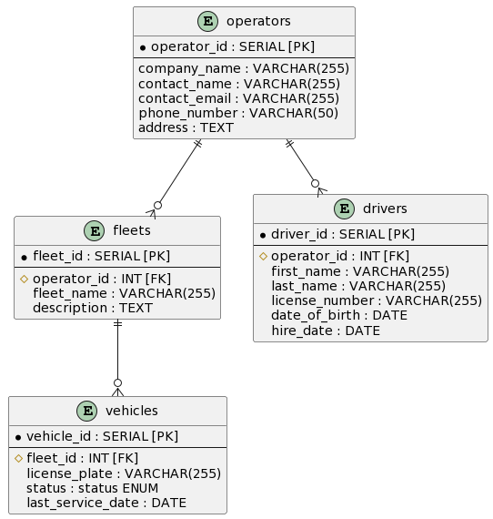
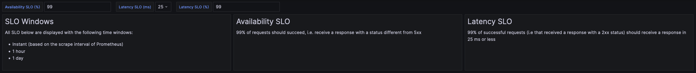

# Simple Fleet Management System

The goal of this project is to illustrate the concepts defined in the [Navigating Service Level Objectives Series](https://medium.com/tblx-insider/navigating-service-level-objectives-series-a-practical-guide-to-reliability-c7375eccb43d).
For that, we will build a simple fleet management system to track vehicles and trips.
The goal is not to have a fully fledged production-grade system, but rather a simple prototype enabling anyone to create SLOs on a system that uses well-known technologies, along with a proven monitoring stack.

<!-- START doctoc generated TOC please keep comment here to allow auto update -->
<!-- DON'T EDIT THIS SECTION, INSTEAD RE-RUN doctoc TO UPDATE -->
## Table of Contents

- [How to run](#how-to-run)
- [TL;DR: Exposed Services](#tldr-exposed-services)
- [REST API](#rest-api)
  - [Endpoints](#endpoints)
  - [Database](#database)
  - [Load Testing](#load-testing)
  - [Monitoring](#monitoring)
  - [Simulating outages](#simulating-outages)

<!-- END doctoc generated TOC please keep comment here to allow auto update -->


## How to run

You need to have Docker and Docker Compose installed.
Then, just run the following commands:

```bash
# Start the monitoring stack
docker compose up -d prometheus
docker compose up -d grafana

# Start the REST API
docker compose up -d rest-api --build

# Run load tests against the REST API
docker compose run --rm k6
```

## TL;DR: Exposed Services

- **Grafana**: http://localhost:3000
- **Prometheus**: http://localhost:9090
- **REST API**: http://localhost:8080
- **REST API - Swagger UI**: http://localhost:8080/swagger-ui.html
- **REST API - Postgres database**: `jdbc:postgresql://localhost:5432/fms` - `admin/admin`
- **REST API - Dashboard**: http://localhost:3000/d/e515d16f-4025-4bb2-bcdb-7d4d5978d92b/rest-api-monitoring

## REST API

The REST API is built using Spring Boot, WebFlux and Spring Data R2DBC.
It is a simple application on top of a PostgreSQL database.

### Endpoints

The API exposes the following endpoints:
- `GET /operators`: Fetch operators in a paginated fashion
- `GET /operators/{operatorId}`: Get operator by id
- `GET /operators/{operatorId}/fleets`: Get fleets associated to an operator
- `GET /operators/{operatorId}/fleets/{fleetId}`: Get a fleet by ID associated to an operator
- `GET /operators/{operatorId}/fleets/{fleetId}/vehicles`: Get vehicles of a fleet and operator
- `GET /operators/{operatorId}/fleets/{fleetId}/vehicles/{vehicleId}`: Get a vehicle by ID of a fleet and operator
- `GET /operators/{operatorId}/drivers`: Get drivers associated to an operator
- `GET /operators/{operatorId}/drivers/{driverId}`: Get a driver by ID associated to an operator

See the [Swagger UI](http://localhost:8080/swagger-ui.html) for more information.

### Database

Here is a diagram representing the database schema used by the REST API (see [V1__Initial.sql](./database/migrations/V1__Initial.sql) for the actual SQL) :



Migrations are handled by a standalone Flyway instance. They can be run using:

```bash
docker compose run --rm flyway
```

Note that the migrations are always ran before launching the `rest-api` service in Docker Compose.

The database is populated with fake data generated using [PostgreSQL Faker](https://gitlab.com/dalibo/postgresql_faker/-/tree/master), details can be found in [V2__Populate.sql](./database/migrations/V2__Populate.sql). This step is ran as part of the migrations.

### Load Testing

Traffic to the REST API can be simulated using the load tests defined in [k6](./k6/).
As the name implies, these load tests are based on [k6](https://k6.io/)m an open-source load testing tool.

The [script.js](./k6/script.js) script runs a simple load test hitting each endpoint sequentially with a constant rate of requests.

To ensure that the load tests actually query real data, relationships are extracted from the database and then used by k6 to query existing combinations of operators / fleets / vehicles and operators / drivers. This extraction is done in docker compose and runs automatically before `k6`, but you can run it yourself as well:

```bash
docker compose run --rm database-extractor
```

By default, the load tests run for 24 hours, with 50 concurrents "clients", generating about 400 requests / second on the REST API.

### Monitoring

The [REST API Monitoring](http://localhost:3000/d/e515d16f-4025-4bb2-bcdb-7d4d5978d92b/rest-api-monitoring) dashboard in Grafana helps visualizing the performance of the REST API using metrics scraped from Prometheus.

The load tests can help generating traffic to have the relevant metrics needed for this dashboard to be useful.

In particular, it also displays well-known SLOs built on top of REST APIs:
- availability SLO, based on the HTTP request success rate
- latency SLO, based on the HTTP request duration

These SLOs are represented over 3 time windows in order to illustrate the important of carefully choosing the right window for your SLOs:
- Instant
- 1 hour
- 1 day

You can change the SLOs using the variables of the dashboard:



The dashboard is composed of 4 rows:
- **Request Rate**: displays information about the instant request rate (per method and uri) and the total requests processed in the time window displayed by Grafana
- **Availability SLO**: SLO counterpart of the request rate, displaying success rate VS error rate, availability and error budget on different time windows
- **PXX Latency**: displays the latency of requests based on the latency SLO chosen in the variables, per method and URI, as a time series and a summary over the time window displayed by Grafana
- **Latency SLO**: SLO counterpart of the latency row, displaying fast rate VS slow rate, availability and error budget on different time windows

### Simulating outages

Since the REST API is dependent on the database to work properly, the easiest way to simulate outages is to act on the database container.

To trigger server errors (impacting the availability SLO), the easiest way is to stop the `database`:

```bash
docker compose stop database
```

To trigger bigger latencies (impacting the latency SLO), the easiest way is to insert a lot of data into the database, e.g. by using the following commands:

```bash
docker compose exec database psql -U admin -d fms
```

Then insert data, for example:

```sql
INSERT INTO fms.drivers (operator_id, first_name, last_name, license_number, date_of_birth, hire_date)
     SELECT (random() * ((select max(operator_id) from fms.operators) - 1) + 1)::INT,
            faker.first_name(),
            faker.last_name(),
            'License--' || id,
            faker.date_this_century()::DATE,
            faker.date_this_decade()::DATE
       FROM generate_series(1, 1000000) AS s(id);
```

This can be reverted by running the follow SQL command:

```sql
DELETE FROM fms.drivers
      WHERE driver_id > 300;
```
